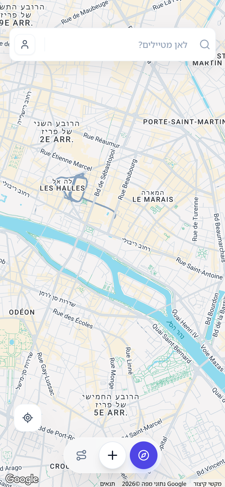
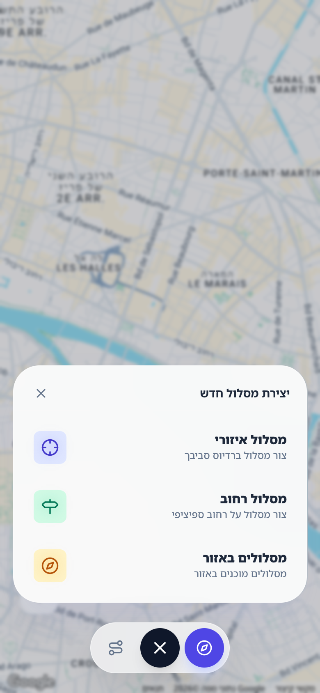
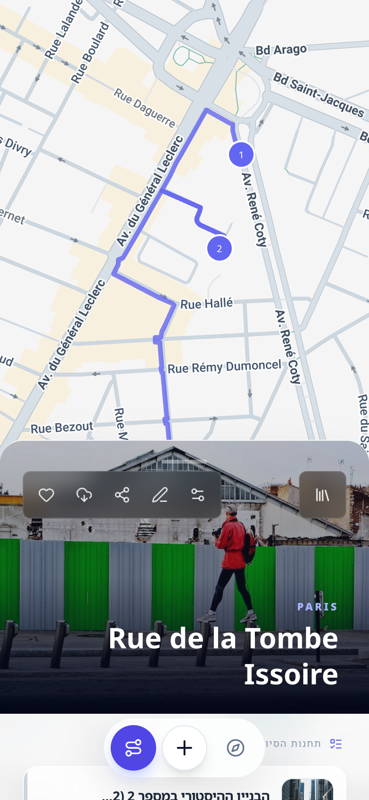
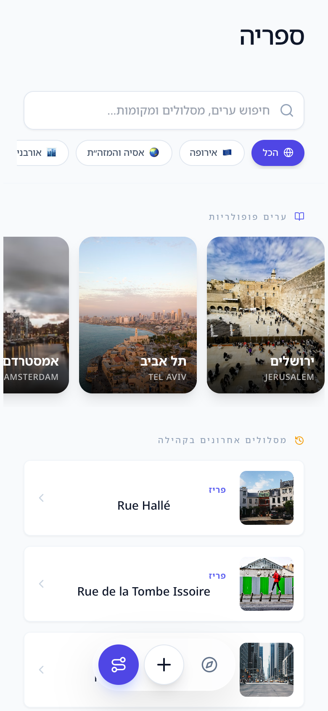

# Urbanito: enhancing Urban Exploration with AI
## Mobile Experience Case Study (2026)

### 1. Overview
**Urbanito** acts as a personal, intelligent guide to the city. Unlike traditional map apps that focus on getting from A to B, Urbanito focuses on the *experience* of the journey itself. By leveraging advanced AI, it generates custom walking routes tailored to the user's immediate context and interests.

**Problem:** Users often struggle to find interesting walking routes that match their specific mood, time constraints, or interests (e.g., "Architecture", "Food", "History"). Standard maps are utilitarian, not experiential.

**Solution:** An AI-powered application that instantly generates curated urban routes, complete with historical context, points of interest (POIs), and navigation guidance.

---

### 2. User Journey
The user experience is designed to be frictionless, moving from intent to exploration in seconds.

1.  **Intent** ("I want a short historical walk")
2.  **Generation** (AI creates a unique route)
3.  **Exploration** (User follows the route with live guidance)
4.  **Reflection** (User saves or shares the experience)

---

### 3. Visual Walkthrough

#### A. The Welcome Experience
The Home Screen is designed for immediate action. Users are greeted with a clean interface that highlights their location context and offers quick access to creating a new journey.

*Design Note: We prioritized a "clean slate" approach, minimizing clutter to focus the user on the primary call-to-action.*

#### B. Crafting the Journey (Creation Flow)
The Creation Menu allows users to input their preferences. By selecting parameters like *Interest* (e.g., History, Art), *Duration*, and *Vibe*, the AI tailors the route generation.

*Design Note: Large, touch-friendly touch targets and clear visual feedback ensure this step is quick and error-free on mobile devices.*

#### C. Active Navigation
Once a route is generated, the user enters Navigation Mode. This view integrates the map with a swipeable card interface for POIs, ensuring users never lose context of their route while learning about their surroundings.

*Design Note: The split-screen approach (Map + Content Card) keeps orientation clear while delivering rich content.*

#### D. Personal Library
The Library view provides a history of past adventures. Users can revisit favorite routes or access saved content offline.

*Design Note: A card-based layout with visual previews helps users quickly identify their past trips.*

---

### 4. Technical Highlights
-   **Frontend**: React + Vite for high performance.
-   **Mobile Native**: Capacitor for iOS/Android integration.
-   **Backend**: Supabase for real-time data and authentication.
-   **AI Engine**: Google Gemini for context-aware route generation.

### 5. Future Roadmap
-   **Premium Tiers**: Exclusive curated content and advanced offline modes.
-   **Social Sharing**: Community-driven route discovery.
-   **AR Integration**: Augmented reality overlays for historical sites.
